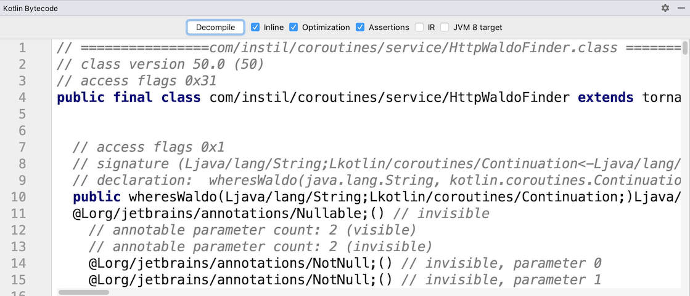

原文链接： [A Bottom-Up View of Kotlin Coroutines](https://www.infoq.com/articles/kotlin-coroutines-bottom-up/) - _Garth Gilmour_ / _Eamonn Boyle_，2020-01-11

# 理解`Kotlin`协程：自底向上的视角

--------------------------------------

<!-- START doctoc generated TOC please keep comment here to allow auto update -->
<!-- DON'T EDIT THIS SECTION, INSTEAD RE-RUN doctoc TO UPDATE -->


- [0. 关键要点](#0-%E5%85%B3%E9%94%AE%E8%A6%81%E7%82%B9)
- [1. 协程的理解挑战](#1-%E5%8D%8F%E7%A8%8B%E7%9A%84%E7%90%86%E8%A7%A3%E6%8C%91%E6%88%98)
- [2. 示例应用](#2-%E7%A4%BA%E4%BE%8B%E5%BA%94%E7%94%A8)
    - [2.1 示例应用（服务端）](#21-%E7%A4%BA%E4%BE%8B%E5%BA%94%E7%94%A8%E6%9C%8D%E5%8A%A1%E7%AB%AF)
    - [2.2 示例应用（客户端）](#22-%E7%A4%BA%E4%BE%8B%E5%BA%94%E7%94%A8%E5%AE%A2%E6%88%B7%E7%AB%AF)
    - [2.3 访问`REST endpoint`的服务](#23-%E8%AE%BF%E9%97%AErest-endpoint%E7%9A%84%E6%9C%8D%E5%8A%A1)
- [3. 开始探索](#3-%E5%BC%80%E5%A7%8B%E6%8E%A2%E7%B4%A2)
    - [3.1 延续传递风格（`Continuation Passing Style`/`CPS`）](#31-%E5%BB%B6%E7%BB%AD%E4%BC%A0%E9%80%92%E9%A3%8E%E6%A0%BCcontinuation-passing-stylecps)
    - [3.2 挂起还是不挂起 —— 这是一个问题](#32-%E6%8C%82%E8%B5%B7%E8%BF%98%E6%98%AF%E4%B8%8D%E6%8C%82%E8%B5%B7--%E8%BF%99%E6%98%AF%E4%B8%80%E4%B8%AA%E9%97%AE%E9%A2%98)
    - [3.3 大`switch`语句（`The Big Switch Statement`）和标签（`label`）](#33-%E5%A4%A7switch%E8%AF%AD%E5%8F%A5the-big-switch-statement%E5%92%8C%E6%A0%87%E7%AD%BElabel)
- [4. 追踪执行](#4-%E8%BF%BD%E8%B8%AA%E6%89%A7%E8%A1%8C)
    - [4.1 第三次调用`fetchNewName`的请求 —— 不挂起](#41-%E7%AC%AC%E4%B8%89%E6%AC%A1%E8%B0%83%E7%94%A8fetchnewname%E7%9A%84%E8%AF%B7%E6%B1%82--%E4%B8%8D%E6%8C%82%E8%B5%B7)
    - [4.2 第三次调用`fetchNewName` —— 挂起](#42-%E7%AC%AC%E4%B8%89%E6%AC%A1%E8%B0%83%E7%94%A8fetchnewname--%E6%8C%82%E8%B5%B7)
    - [4.3 总结执行](#43-%E6%80%BB%E7%BB%93%E6%89%A7%E8%A1%8C)
- [5. 结论](#5-%E7%BB%93%E8%AE%BA)

<!-- END doctoc generated TOC please keep comment here to allow auto update -->

--------------------------------------

## 0. 关键要点

- `JVM`没有原生支持协程（`coroutines`）
- `Kotlin`在编译器中通过转换为状态机的方式实现协程
- `Kotlin`协程的实现使用了一个关键字，剩下的通过库来实现
- `Kotlin`使用延续传递风格（`Continuation Passing Style`/`CPS`）来实现协程
- 协程使用了调度器（`Dispatchers`），因此在`JavaFX`、`Android`、`Swing`等中使用方式略有不同

--------------------------------------

协程是一个令人着迷的主题，尽管并不是一个新话题。正如[其他地方所说的那样](https://www.youtube.com/watch?v=dWBsdh0BndM)，协程多年来已经被多次重新发现，通常是作为轻量级线程（`lightweight threading`）或『回调地狱』（`callback hell`）的解决方案。

最近在`JVM`上，协程已成为反应式编程（`Reactive Programming`）的一种替代方法。诸如[`RxJava`](https://github.com/ReactiveX/RxJava)或[`Project Reactor`](https://projectreactor.io/)之类的框架为客户端提供了一种增量处理传入信息的方式，并且对节流（`throttling`）和并行（`parallelism`）提供了广泛的支持。但是，您必须围绕反应流（`reactive streams`）上的函数式操作（`functional operations`）来重新组织代码，[在很多情况下这样做成本是大于收益的](https://www.youtube.com/watch?v=5TJiTSWktLU)。

这就是为什么像`Android`社区会对更简单的替代方案有需求的原因。`Kotlin`语言引入协程作为一个实验功能来满足这个需求，并且经过改进后已成为`Kotlin 1.3`的正式功能。`Kotlin`协程的采用范围已从`UI`开发拓展到服务器端框架（例如[`Spring 5`添加了支持](https://www.baeldung.com/spring-boot-kotlin-coroutines)），甚至是像`Arrow`之类的函数式框架（通过[`Arrow Fx`](https://arrow-kt.io/docs/effects/fx/)）。

## 1. 协程的理解挑战

不幸的是理解协程并非易事。尽管`Kotlin`专家进行了许多协程介绍分享，但主要是关于协程是什么（或应如何使用）这方面的见解和介绍。你可能会说协程是并行编程的单子🙂。

而要理解协程有挑战的其实是底层实现。在`Kotlin`协程，编译器仅实现 **_`suspend`_** 关键字，其他所有内容都由协程库处理。结果是，`Kotlin`协程非常强大和灵活，但同时也显得用无定形。对于新手来说，这是学习障碍，新手想要的是有一致的指导方针和固定的原则来学习。本文有意于提供这个基础，自底向上地介绍协程。

## 2. 示例应用

### 2.1 示例应用（服务端）

示例应用是一个典型问题：安全有效地对`RESTful`服务进行多次调用。播放[《威利在哪里？》](https://en.wikipedia.org/wiki/Where%27s_Wally%3F)的文本版本 —— 用户要追踪一个连着一个的人名链，直到出现`Waldo`。

> 【译注】《威利在哪里？》是一套由英国插画家 _Martin Handford_ 创作的儿童书籍。这个书的目标就是在一张人山人海的图片中找出一个特定的人物 —— 威利。他总是会弄丢东西，如书本、野营设备甚至是他的鞋子，而读者也要帮他在图中找出这些东西来。更多参见 [威利在哪里 - 百度百科](https://baike.baidu.com/item/%E5%A8%81%E5%88%A9%E5%9C%A8%E5%93%AA%E9%87%8C/1019034)、[威利在哪里 - 维基百科](https://zh.wikipedia.org/wiki/%E5%A8%81%E5%88%A9%E5%9C%A8%E5%93%AA%E9%87%8C%EF%BC%9F)。

下面是用[`Http4k`](https://www.http4k.org/)编写的完整`RESTful`服务实现。`Http4k`是 _Marius Eriksen_ 的[著名论文](https://monkey.org/~marius/funsrv.pdf)中所写的函数式服务端架构的`Kotlin`版本实现。实现有许多其他语言，包括`Scala`（[`Http4s`](https://http4s.org/)）和`Java 8`或更高版本（[`Http4j`](https://github.com/fzakaria/http4j)）。

实现有唯一一个`endpoint`，通过`Map`实现人名链。给定一个人名，返回匹配值和200状态代码，或是返回404和错误消息。

```kotlin
fun main() {
   val names = mapOf(
       "Jane" to "Dave",
       "Dave" to "Mary",
       "Mary" to "Pete",
       "Pete" to "Lucy",
       "Lucy" to "Waldo"
   )

   val lookupName = { request: Request ->
       val name = request.path("name")
       val headers = listOf("Content-Type" to "text/plain")
       val result = names[name]
       if (result != null) {
           Response(OK)
               .headers(headers)
               .body(result)
       } else {
           Response(NOT_FOUND)
               .headers(headers)
               .body("No match for $name")
       }
   }

   routes(
       "/wheresWaldo" bind routes(
           "/{name:.*}" bind Method.GET to lookupName
       )
   ).asServer(Netty(8080))
       .start()
}
```

也就是说，我们的客户要完成的操作是执行下面的请求链：

```ruby
$ curl http://localhost:8080/wheresWaldo/Mary
Pete
$ curl http://localhost:8080/wheresWaldo/Pete
Lucy
$ curl http://localhost:8080/wheresWaldo/Lucy
Waldo
```

### 2.2 示例应用（客户端）

客户端应用基于`JavaFX`库来创建桌面用户界面，为了简化任务并避免不必要的细节，使用[`TornadoFX`](https://github.com/edvin/tornadofx)，它为`JavaFX`提供了`Kotlin`的`DSL`实现。

下面是客户端视图的完整定义：

```kotlin
class HelloWorldView: View("Coroutines Client UI") {
   private val finder: HttpWaldoFinder by inject()
   private val inputText = SimpleStringProperty("Jane")
   private val resultText = SimpleStringProperty("")

   override val root = form {
       fieldset("Lets Find Waldo") {
           field("First Name:") {
               textfield().bind(inputText)
               button("Search") {
                   action {
                       println("Running event handler".addThreadId())
                       searchForWaldo()
                   }
               }
           }
           field("Result:") {
               label(resultText)
           }
       }
   }

   private fun searchForWaldo() {
       GlobalScope.launch(Dispatchers.Main) {
           println("Doing Coroutines".addThreadId())
           val input = inputText.value
           val output = finder.wheresWaldo(input)
           resultText.value = output
       }
   }
}
```

另外还使用了下面的辅助函数作为`String`类型的扩展方法：

```kotlin
fun String.addThreadId() = "$this on thread ${Thread.currentThread().id}"
```

下面是用户界面运行起来的样子：


当用户单击按钮时，会启动一个新的协程，并通过类型为`HttpWaldoFinder`的服务对象访问`RESTful endpoint`。

`Kotlin`协程存在于`CoroutineScope`之中，`CoroutineScope`关联了表示底层并发模型的`Dispatcher`。并发模型通常是线程池，但可以是其它的。

有哪些`Dispatcher`可用取决于`Kotlin`代码的所运行环境。`Main Dispatcher`对应的是`UI`库的事件处理线程，因此（在`JVM`上）仅在`Android`、`JavaFX`和`Swing`中可用。`Kotlin Native`的协程在开始时完全不支持多线程，[但是这种情况正在改变](https://www.youtube.com/watch?v=oxQ6e1VeH4M)。在服务端，可以自己引入协程，但是缺省就可用情况会越来越多，[比如在`Spring 5`中](https://www.baeldung.com/spring-boot-kotlin-coroutines)。

在开始调用挂起方法（`suspending methods`）之前，必须要有一个协程、一个`CoroutineScope`和一个`Dispatcher`。如果是最开始的调用（如上面的代码所示），可以通过『协程构建器』（`coroutine builder`）函数（如`launch`和`async`）来启动这个过程。

调用协程构建器函数或诸如`withContext`之类的上下文函数总会创建一个新的`CoroutineScope`。在这个上下文中，一个执行任务对应的是由`Job`实例构成的一个层次结构。

任务具有一些有趣的属性，即：

- `Job`在自己完成之前，会等待自己区域中的所有协程完成。
- 取消`Job`导致其所有子`Job`被取消。
- `Job`的失败或取消会传播给他的父`Job`。

这样的设计是为了避免并发编程中的常见问题，例如在没有终止子任务的情况下终止了父任务。

### 2.3 访问`REST endpoint`的服务

下面是`HttpWaldoFinder`服务的完整代码：

```kotlin
class HttpWaldoFinder : Controller(), WaldoFinder {
   override suspend fun wheresWaldo(starterName: String): String {
       val firstName = fetchNewName(starterName)
       println("Found $firstName name".addThreadId())

       val secondName = fetchNewName(firstName)
       println("Found $secondName name".addThreadId())

       val thirdName = fetchNewName(secondName)
       println("Found $thirdName name".addThreadId())

       val fourthName = fetchNewName(thirdName)
       println("Found $fourthName name".addThreadId())

       return fetchNewName(fourthName)
   }

   private suspend fun fetchNewName(inputName: String): String {
       val url = URI("http://localhost:8080/wheresWaldo/$inputName")
       val client = HttpClient.newBuilder().build()
       val handler = HttpResponse.BodyHandlers.ofString()
       val request = HttpRequest.newBuilder().uri(url).build()

       return withContext<String>(Dispatchers.IO) {
           println("Sending HTTP Request for $inputName".addThreadId())
           client
               .send(request, handler)
               .body()
       }
   }
}
```

`fetchNewName`函数的参数是已知人名，在`endpoint`中查询关联的人名。通过`HttpClient`类完成，这个类在`Java 11`及以后版本的标准库中。实际的`HTTP GET`操作在使用`IO Dispatcher`的新子协程中运行。`IO Dispatcher`代表了为长时间运行的活动（如网络调用）优化的线程池。

`wheresWaldo`函数追踪人名称链五次，以（期望能）找到`Waldo`。因为后面要反汇编生成的字节码，所以逻辑实现得尽可能简单。我们感兴趣的是，每次调用`fetchNewName`都会导致当前协程被挂起，尽管它的子协程会在运行。在这种特殊情况下，父协程在`Main Dispatcher`上运行，而子协程在`IO Dispatcher`上运行。因此，尽管子协程在执行`HTTP`请求，`UI`事件处理线程已经释放了，以处理其他用户与视图的交互。如下图所示：


当调用挂起函数时，`IntelliJ`会提示在协程之间有控制权转移。请注意，如果不切换`Dispatcher`，则调用不一定会导致新协程的创建。当一个挂起函数调用另一个挂起函数时，可以在同一协程中继续执行，实际上，如果处于在同一线程上，这就是我们想要的行为。


当执行客户端时，控制台的输出如下：

```sh
Sending HTTP Request for Lucy on thread 24
Running event handler on thread 17
Doing Coroutines on thread 17
Sending HTTP Request for Jane on thread 24
Found Dave name on thread 17
Sending HTTP Request for Dave on thread 24
Found Mary name on thread 17
Sending HTTP Request for Mary on thread 24
Found Pete name on thread 17
Sending HTTP Request for Pete on thread 26
Found Lucy name on thread 17
Sending HTTP Request for Lucy on thread 26
```

可以看到，对于上面的这次运行，`Main Dispatcher`/`UI`事件`Handler`在线程17上运行，而`IO Dispatcher`在包含线程24和26的线程池上运行。

## 3. 开始探索

使用`IntelliJ`自带的字节码反汇编工具，可以窥探底层的实际情况。注意，也可以使用`JDK`自带的标准`javap`工具。



可以看到`HttpWaldoFinder`的方法签名已经改变了，因此可以接受延续对象（`continuation object`）作为额外的参数，并返回一个通用的`Object`。

```java
public final class HttpWaldoFinder extends Controller implements WaldoFinder {
  public Object wheresWaldo(String a, Continuation b)

  final synthetic Object fetchNewName(String a, Continuation b)
}
```

现在，让我们深入研究添加到这些方法中的代码，并解释『延续（`Continuation`）』是什么，以及返回的是什么。

### 3.1 延续传递风格（`Continuation Passing Style`/`CPS`）

正如`Kotlin`标准化流程（也称为`KEEP`）中的[协程提案](https://github.com/Kotlin/KEEP/blob/master/proposals/coroutines.md)所记录的，协程的实现基于『延续传递风格』。延续对象用于存储函数在挂起期间所需的状态。

挂起函数的每个局部变量都成为延续的字段。另外还需要为各个函数的参数和当前对象（如果函数是方法）创建字段。因此，有四个参数和五个局部变量的挂起方法有至少十个字段的延续。

对于`HttpWaldoFinder`中的`wheresWaldo`方法，只有一个参数和四个局部变量，因此延续实现类型具有六个字段。如果将`Kotlin`编译器生成的字节码反汇编为`Java`源代码，可以看到确实如此：

```java
$continuation = new ContinuationImpl($completion) {
  Object result;
  int label;
  Object L$0;
  Object L$1;
  Object L$2;
  Object L$3;
  Object L$4;
  Object L$5;

  @Nullable
  public final Object invokeSuspend(@NotNull Object $result) {
     this.result = $result;
     this.label |= Integer.MIN_VALUE;
     return HttpWaldoFinder.this.wheresWaldo((String)null, this);
  }
};
```

由于所有字段都为`Object`类型，因此如何使用它们并不是很明显。但是随着我们进一步探索，可以看到：

- `L$0`持有对`HttpWaldoFinder`实例的引用。始终有值。
- `L$1`持有`starterName`参数的值。始终有值。
- `L$2`到`L$5`持有局部变量的值。在代码执行时逐步填充。`L$2`将持有`firstName`的值，依此类推。

另外还有用于最终结果的字段，以及一个名为`label`的引人注意的整数字段。

### 3.2 挂起还是不挂起 —— 这是一个问题

在检查生成的代码时，需要记住：整个过程必须处理两个用例。每当一个挂起函数在调用另一个挂起函数时，要么挂起当前协程（以便另一个可以在同一线程上运行），要么继续执行当前协程。

考虑一个从数据存储中读取的挂起函数，在发生`IO`操作时这个函数起很可能会挂起，但也可能读取的是缓存的结果。后续调用可以同步返回缓存的值，而不会挂起。`Kotlin`编译器生成的代码对于这两个路径必须都是允许的。

`Kotlin`编译器调整了每个挂起函数的返回类型，以便可以返回实际结果或特殊值 _`COROUTINE_SUSPENDED`_。对于后一种情况下当前的协程是被挂起的。这就是挂起函数的返回类型从结果类型更改为`Object`的原因。

我们的示例应用`wheresWaldo`会重复调用`fetchNewName`。从理论上讲，这些调用中的都可以挂起或不挂起当前的协程。在写`fetchNewName`的时候，我们知道的是挂起总是会发生。但是，如果要理解所生成的代码，我们必须记住，实现需要能够处理所有可能性。

### 3.3 大`switch`语句（`The Big Switch Statement`）和标签（`label`）

如果进一步查看反汇编的代码，会发现埋在多个嵌套标签中的`switch`语句。这是状态机（`state machine`）的实现，用于控制`wheresWaldo()`方法中的不同挂起点。下面的代码用于说明`switch`语句的高层结构：

```java
// listing one: the generated switch statement and labels
String firstName;
String secondName;
String thirdName;
String fourthName;
Object var11;
Object var10000;
label48: {
  label47: {
    label46: {
        Object $result = $continuation.result;
        var11 = IntrinsicsKt.getCOROUTINE_SUSPENDED();
        switch($continuation.label) {
        case 0:
            // code omitted
        case 1:
            // code omitted
        case 2:
            // code omitted
        case 3:
            // code omitted
        case 4:
            // code omitted
        case 5:
            // code omitted
        default:
           throw new IllegalStateException(
                "call to 'resume' before 'invoke' with coroutine");
        } // end of switch
        // code omitted
    } // end of label 46
    // code omitted
  } // end of label 47
  // code omitted
} // end of label 48
// code omitted
```

现在可以看清楚延续的`label`字段的用途。当完成`wheresWaldo`的不同阶段时，更改`label`的值。嵌套的标签块包含原来`Kotlin`代码中挂起点之间的代码块。`label`的值允许重新进入该代码：跳到上次挂起的位置（适当的`case`语句），从延续中提取一些数据，然后开始执行对应的标签块代码 。

但是，如果所有的挂起点都没有实际挂起，则整个代码块会同步执行掉。在生成的代码中，下面的代码片段反复出现：

```java
// listing two - deciding if the current coroutine should suspend
if (var10000 == var11) {
  return var11;
}
```

从之前的代码可以知道，`var11`的值是 _`CONTINUATION_SUSPENDED`_，而`var10000`保存的是调用另一个挂起函数的返回值。因此，当发生挂起时，代码将返回（之后会重新进入）；如果没有发生挂起，代码会穿过了一个标签，直接继续执行这个标签之后的代码。

再强调一次，请记住：生成的代码不能假定所有调用都将挂起，或者所有调用都将继续执行当前协程。必须能够应对任何可能的组合。

## 4. 追踪执行

当执行开始时，延续中`label`字段的值设置的是`0`。`switch`语句中相应分支代码如下：

```java
// listing three - the first branch of the switch
case 0:
  ResultKt.throwOnFailure($result);
  $continuation.L$0 = this;
  $continuation.L$1 = starterName;
  $continuation.label = 1;
  var10000 = this.fetchNewName(starterName, $continuation);
  if (var10000 == var11) {
    return var11;
  }
  break;
```

将实例和参数存储到延续对象中，然后将延续对象传递给`fetchNewName`。如前文所述，编译器生成的`fetchNewName`版本将返回实际结果或 _`COROUTINE_SUSPENDED`_ 值。

如果协程被挂起，那么从函数中返回，并且当协程继续时跳转到`case 1`分支。如果继续执行当前的协程（即没有被挂起），那么将穿过`switch`语句的一个标签，执行下面的代码：

```java
// listing four - calling ‘fetchNewName’ for the second time
firstName = (String)var10000;
secondName = UtilsKt.addThreadId("Found " + firstName + " name");
boolean var13 = false;
System.out.println(secondName);
$continuation.L$0 = this;
$continuation.L$1 = starterName;
$continuation.L$2 = firstName;
$continuation.label = 2;
var10000 = this.fetchNewName(firstName, $continuation);
if (var10000 == var11) {
  return var11;
}
```

因为知道`var10000`是函数返回值，所以可以将其转型为正确的类型并存储在本地变量`firstName`中。然后，生成的代码使用变量`secondName`存储连接线程`ID`的结果，然后将其打印出来。

更新延续中的字段，以添加从服务器检索到的值。请注意，`label`的值现在为2。然后，我们第三次调用`fetchNewName`。

### 4.1 第三次调用`fetchNewName`的请求 —— 不挂起

我们必须再次基于`fetchNewName`返回的值进行选择，如果返回的值是 _`COROUTINE_SUSPENDED`_，那么我们将从当前函数返回。下次调用时，我们将进入`switch`语句的`case 2`分支。

如果我们继续当前的协程，则执行下面的代码块。正如您所看到的，它与上面的相同，除了我们现在有更多数据要存储在延续中。

```java
// listing four - calling ‘fetchNewName’ for the third time
secondName = (String)var10000;
thirdName = UtilsKt.addThreadId("Found " + secondName + " name");
boolean var14 = false;
System.out.println(thirdName);
$continuation.L$0 = this;
$continuation.L$1 = starterName;
$continuation.L$2 = firstName;
$continuation.L$3 = secondName;
$continuation.label = 3;
var10000 = this.fetchNewName(secondName, (Continuation)$continuation);
if (var10000 == var11) {
  return var11;
}
```

对于所有剩余的调用（假设从未返回 _`COROUTINE_SUSPENDED`_），此模式将重复进行，直到到达结尾为止。

### 4.2 第三次调用`fetchNewName` —— 挂起

另一情况是协程被挂起，那么要运行下面的`case`块：

```java
// listing five - the third branch of the switch
case 2:
  firstName = (String)$continuation.L$2;
  starterName = (String)$continuation.L$1;
  this = (HttpWaldoFinder)$continuation.L$0;
  ResultKt.throwOnFailure($result);
  var10000 = $result;
  break label46;
```

从延续中提取值到函数的局部变量中。然后用带标签的`break`将执行跳转到上面的代码段4。因此，最终将在同一个地方结束整个协程的执行。

### 4.3 总结执行

现在我们可以重新梳理代码结构，并对每个部分中所做的进行高层的描述：

```java
// listing six - the generated switch statement and labels in depth
String firstName;
String secondName;
String thirdName;
String fourthName;
Object var11;
Object var10000;
label48: {
  label47: {
     label46: {
        Object $result = $continuation.result;
        var11 = IntrinsicsKt.getCOROUTINE_SUSPENDED();
        switch($continuation.label) {
        case 0:
            // set label to 1 and make the first call to ‘fetchNewName’
            // if suspending return, otherwise break from the switch
        case 1:
            // extract the parameter from the continuation
            // break from the switch
        case 2:
            // extract the parameter and first result from the continuation
            // break to outside ‘label46’
        case 3:
            // extract the parameter, first and second results from the
            //   continuation
            // break to outside ‘label47’
        case 4:
            // extract the parameter, first, second and third results from
            //   the continuation
            // break to outside ‘label48’
        case 5:
            // extract the parameter, first, second, third and fourth
            //   results from the continuation
            // return the final result
        default:
           throw new IllegalStateException(
                "call to 'resume' before 'invoke' with coroutine");
        } // end of switch
        // store the parameter and first result in the continuation
        // set the label to 2 and make the second call to ‘fetchNewName’
        // if suspending return, otherwise proceed
    } // end of label 46
        // store the parameter, first and second results in the
        //   continuation
        // set the label to 3 and make the third call to ‘fetchNewName’
        // if suspending return, otherwise proceed
  } // end of label 47
        // store the parameter, first, second and third results in the
        //   continuation
        // set the label to 4 and make the fourth call to ‘fetchNewName’
        // if suspending return, otherwise proceed
} // end of label 48
// store the parameter, first, second, third and fourth results in the continuation
// set the label to 5 and make the fifth call to ‘fetchNewName’
// return either the final result or COROUTINE_SUSPENDED
```

## 5. 结论

这不是一份容易理解的代码。我们研究了由`Kotlin`编译器生成的字节码所反汇编的`Java`代码。`Kotlin`编译器生成的字节码目标是执行的效率和简约，而不是清晰易读。

我们可以得出一些有用的结论：

1. **没有魔法**。当次了解协程时，很容易以为会有一些特殊的『魔法』来把所有东西连接起来。正如我们上面所看到的，生成的代码只使用过程编程（`procedural programming`）的基本构建块，比如条件语句和带有标签的`break`。
2. **实现是基于延续的**。如`KEEP`提案中所说明，实现函数的挂起和恢复的方式是将函数的状态捕捉到一个对象中。因此，对于每一个挂起函数，编译器会创建一个具有`N`个字段的延续类，其中`N`是函数参数个数加上函数变量个数加上3。最后三个持有当前对象，最终结果和索引。
3. **执行始终遵循标准模式**。如果要从挂起中恢复，使用的是延续的`label`字段跳转到`switch`语句的对应分支。在这个分支中，从延续对象中取出所找到的数据，然后用带有标签的`break`语句跳转到如果没有发生挂起所要执行的代码。

------------------------

**关于作者**


**[Garth Gilmour](https://twitter.com/GarthGilmour)** 是`Instil`的学习主管。他在1999年放弃了全职开发工作，先是给`C`程序员讲授`C++`，然后给`C++`程序员讲授`Java`，再给`Java`程序员讲授`C#`，现在向所有人讲授所有东西，但更喜欢讲授`Kotlin`。如果算算上过的课话，那一定会超过1000次了。他是20多门课程的作者，经常在聚会上演讲，在国家和国际会议上发表演讲，并共同组织了贝尔法斯特（北爱尔兰首府）开发者活动的`BASH`系列主题和最近成立的贝尔法斯特`Kotlin`用户组。如不在黑板前，他以教色列搏击术（_Krav Maga_）和练举重。


**[Eamonn Boyle](https://twitter.com/BoyleEamonn)** 从事软件开发、架构师和团队管理超过15年。在过去的大约四年中，他一直是一名全职培训师和教练，为很多不同的组织撰写和提供有关各种主题的课程。包括从核心语言技能与框架到工具与过程的范式和技术。还在包括`Goto`和`KotlinConf`在内的许多会议、活动和聚会中演讲并举办了研讨会。
